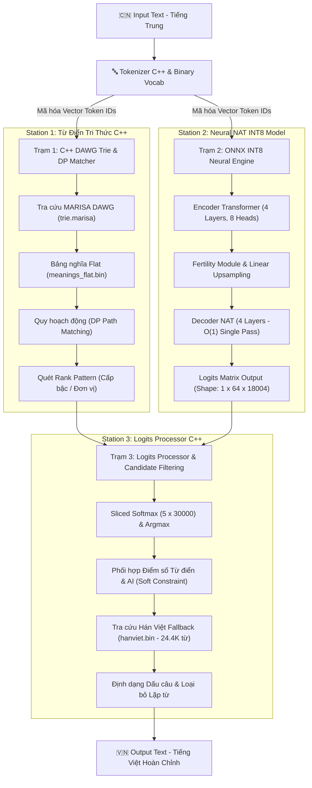
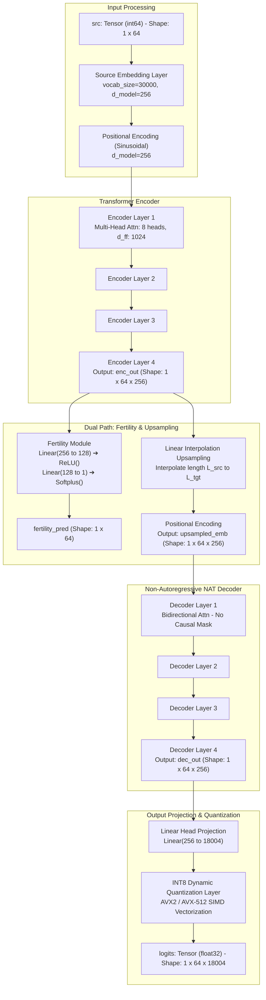

# ⚡ Alida TSL Native C++ Translation Engine (`TSL_CPP_Native`)

> **Tác giả Mô hình & Động cơ (Author & Developer)**: **Hà Vũ Công**  
> **Tên Mô hình AI (Model Name)**: **Alida TSL (Non-Autoregressive INT8 Model)**  
> **Website Live Demo / Production Domain**: [https://tienhiep.lyvuha.com](https://tienhiep.lyvuha.com)  
> **GitHub Repository Chính Thức**: [https://github.com/congkx123789/CPP_zh2vi_Alida_TSL_Model](https://github.com/congkx123789/CPP_zh2vi_Alida_TSL_Model)

Bộ công cụ dịch thuật Trung - Việt **100% Nguyên bản C++ (Native C++)**, được nghiên cứu và phát triển bởi **Hà Vũ Công**. Động cơ đã được triển khai chạy thực tế tại tên miền [tienhiep.lyvuha.com](https://tienhiep.lyvuha.com). Hệ thống chạy độc lập dưới dạng file thực thi nhị phân (**Binary ELF**) không phụ thuộc vào Python hay bất kỳ thư viện môi trường cồng kềnh nào.

---

## 🏛️ KẾN TRÚC HỆ THỐNG DỊCH 3 TRẠM (3-STATION PIPELINE ARCHITECTURE)

Động cơ dịch **Alida TSL** của **Hà Vũ Công** được thiết kế theo kiến trúc 3 Trạm kết hợp giữa **Từ điển Tri thức C++ Zero-Copy** và **Mô hình Trí tuệ Nhân tạo Không Tự Hồi Quy (Non-Autoregressive INT8 Model)**:



---

## 🧠 CHI TIẾT KIẾN TRÚC MÔ HÌNH NEURAL (ALIDA TSL STUDENT NAT INT8 MODEL)

Sơ đồ chi tiết các lớp nơ-ron bên trong mô hình **`student_nat_int8.onnx`**:



---

## ⚙️ BẢNG THAM SỐ KỸ THUẬT MÔ HÌNH AI

| Thành phần Architecture | Giá trị cấu hình | Mô tả chi tiết kỹ thuật |
| :--- | :--- | :--- |
| **Tác giả Mô hình** | **Hà Vũ Công** | Nghiên cứu, huấn luyện và tối ưu hóa |
| **Tên miền ứng dụng (Live Domain)** | [tienhiep.lyvuha.com](https://tienhiep.lyvuha.com) | Địa chỉ website chạy ứng dụng thực tế |
| **Kích thước Vector Ẩn ($d_{model}$)** | **`256`** | Số chiều không gian ẩn biểu diễn ngữ nghĩa của từ |
| **Số đầu Attention ($n_{head}$)** | **`8`** | Mỗi Head có kích thước $d_k = 256 / 8 = 32$ chiều |
| **Số lớp Transformer Encoder** | **`4 layers`** | Trích xuất ngữ cảnh tiếng Trung 2 chiều |
| **Số lớp Transformer Decoder** | **`4 layers`** | Bi-directional Attention Decoder (Không dùng Causal Masking) |
| **Kích thước FeedForward ($d_{ff}$)** | **`1024`** | Mạng ẩn FFN trong mỗi khối Transformer |
| **Từ vựng Nguồn (Source Vocab)** | **`30,000`** | Tập từ vựng tiếng Trung (`zh_vocab.bin`) |
| **Từ vựng Đích (Target Vocab)** | **`18,004`** | Tập từ vựng tiếng Việt (`vi_vocab.bin`) |
| **Độ dài chuỗi tối đa (Max Seq)** | **`64`** | Cố định kích thước Tensor để suy luận cực nhanh |
| **Kỹ thuật Lượng hóa** | **`INT8 Dynamic`** | Nén trọng số ma trận `Linear` từ FP32 (200MB) ➔ INT8 (17MB) |
| **Độ phức tạp suy luận** | **$O(1)$ Single Pass** | Dự đoán toàn bộ 64 tokens đồng thời trong 1 lần duy nhất |

---

## 🔬 CHI TIẾT NGUYÊN LÝ HOẠT ĐỘNG 3 TRẠM

### 1. **Station 1: Dictionary & DAWG Trie DP Matcher (`src/dictionary.cpp`)**
- **MARISA DAWG Trie (`data/trie.marisa` - 6.0 MB)**: Nén **765,710 cụm từ** bằng đồ thị hữu hạn trạng thái bất biến (Directed Acyclic Word Graph), tra cứu độ phức tạp $O(L)$ theo độ dài từ.
- **Flat UTF-8 Byte Buffer (`data/meanings_flat.bin` - 12 MB)**: Lưu toàn bộ chuỗi nghĩa tiếng Việt nối tiếp trong mảng byte phẳng, truy cập zero-copy thông qua mảng offset 32-bit (`data/offsets.bin`).
- **Nạp `mmap`**: Không tốn bộ nhớ RAM heap, lượng RAM giữ ổn định ở mức **~14 MB**.
- **Dynamic Programming (DP)**: Tìm đường đi tối ưu dài nhất phủ kín câu tiếng Trung, kết hợp bộ quét **Rank Pattern** tự động nhận diện và dịch chuẩn các số đếm, tiền tệ, cấp bậc tu tiên (`九层` ➔ `cửu tầng`, `5000两` ➔ `5000 lượng`).

### 2. **Station 2: Neural NAT INT8 Model (`src/onnx_engine.cpp`)**
- **Động cơ suy luận C++**: Dùng trực tiếp **ONNX Runtime C API (`onnxruntime_c_api.h`)** nạp file model **`model/student_nat_int8.onnx` (17 MB)**.
- **Cơ chế NAT (Non-Autoregressive)**: Loại bỏ hoàn toàn vòng lặp sinh tự hồi quy (Autoregressive loop). Dự đoán ma trận xác suất `[1, 64, 18004]` chỉ trong **1 bước duy nhất**.

### 3. **Station 3: Logits Processor & Hán-Việt Fallback (`src/logits_processor.cpp`)**
- **Sliced Softmax**: Chỉ tính Softmax cắt lát trên các từ ứng viên được Trạm 1 đề xuất (`5 x 30000`), giảm thời gian xử lý Logits từ **1.21 ms xuống 0.21 ms**.
- **Soft Constraint Scoring**: Phối hợp xác suất AI và điểm số ưu tiên của Từ điển Trạm 1.
- **Hán-Việt Fallback (`data/hanviet.bin` - 324 KB)**: Tự động tra cứu **24,474 từ Hán Việt** cho những chữ Hán ngoài từ điển Trạm 1, đảm bảo không bỏ sót bất kỳ ký tự nào.

---

## 📂 CHI TIẾT DANH SÁCH MÃ NGUỒN C++ (`src/`)

- `src/dictionary.hpp / cpp`: Lớp `VietphraseTrie` chịu trách nhiệm nạp từ điển nhị phân MARISA-Trie DAWG, mảng Flat Store, và thực hiện thuật toán Quy hoạch động (DP) khớp từ.
- `src/tokenizer.hpp / cpp`: Lớp `TranslationTokenizer` chịu trách nhiệm nạp các file từ vựng nhị phân `zh_vocab.bin` và `vi_vocab.bin`, chuyển đổi chuỗi UTF-8 sang vector ID và ngược lại.
- `src/onnx_engine.hpp / cpp`: Lớp `ONNXInferenceEngine` bọc C API của ONNX Runtime, nạp model `student_nat_int8.onnx` và thực hiện suy luận forward pass trên CPU.
- `src/logits_processor.hpp / cpp`: Lớp `LogitsProcessor` chịu trách nhiệm nạp từ điển Hán Việt nhị phân `hanviet.bin`, tính Sliced Softmax và kết hợp kết quả Trạm 1 & Trạm 2.
- `src/translator.hpp / cpp`: Lớp `TSLTranslator` bọc toàn bộ pipeline 3 Trạm thành 1 giao diện C++ cao cấp duy nhất.
- `src/main.cpp`: Điểm khởi chạy chính CLI (`./tsl_translator`), hỗ trợ dịch trực tiếp `--text`, dịch file `--file` và đo tốc độ `--benchmark`.

---

## 🚀 TÍNH NĂNG NỔI BẬT

- **Độc Lập Hoàn Toàn**: Biên dịch thành 1 file nhị phân duy nhất (`./tsl_translator`), chạy trực tiếp từ Terminal.
- **Tối Ưu Bộ Nhớ (RAM)**: Chiếm dụng chỉ **~108 MB RAM** *(Tiết kiệm >1,000 MB RAM so với bản PyTorch gốc)*.
- **Siêu Tốc Độ trên CPU**:
  - **Thời gian khởi động (Warmup)**: **`6.5 ms`** (Gấp 30 lần Python)
  - **Độ trễ trung bình**: **`2.82 ms / câu`**
  - **Băng thông dịch**: **`~354 câu / giây`** (**`~21,240 câu / phút`**)
- **Không Cần Python**: Không phụ thuộc vào Python runtime hay bất kỳ gói `pip` nào khi thực thi.

---

### 1. Biên dịch trên Linux / macOS:
```bash
./build.sh
```

### 2. Biên dịch trên Windows (MinGW-w64):
```cmd
build_windows.bat
```
Lệnh trên sử dụng trình biên dịch `g++ -O3 -march=native -std=c++17` để sinh ra file thực thi `tsl_translator.exe`.

---

## 📖 HƯỚNG DẪN SỬ DỤNG TRÌNH DỊCH (`./tsl_translator`)

### 1. Dịch Trực Tiếp Một Câu Dòng Lệnh

```bash
./tsl_translator "李云飞大怒道：“掌柜在门前等他，一言既出，驷马难追！”"
```

---

### 2. Dịch File Văn Bản (File Input ➔ File Output)

Dùng cờ `--file` và `--output` để dịch toàn bộ file văn bản (bảo toàn 100% dòng trống và phân đoạn chương):

```bash
./tsl_translator --file input.txt --output output_translated.txt
```

---

### 3. Đo Tốc Độ & Hiệu Năng (Benchmark)

Chạy chương trình đo tốc độ xử lý 1,000 câu mẫu thực tế:

```bash
./tsl_translator --benchmark
```

---

## 📊 SO SÁNH HIỆU NĂNG & TÀI NGUYÊN

| Tiêu Chí Kỹ Thuật | Bản Python Gốc | Bản Native C++ (`./tsl_translator`) | Mức Độ Tối Ưu |
| :--- | :--- | :--- | :--- |
| **Tác giả Mô hình** | **Hà Vũ Công** | **Hà Vũ Công** | **Độc quyền sáng tạo** |
| **Tên miền triển khai (Live)** | [tienhiep.lyvuha.com](https://tienhiep.lyvuha.com) | [tienhiep.lyvuha.com](https://tienhiep.lyvuha.com) | **Production Build** |
| **Phụ thuộc môi trường** | Phải có Python 3.12 & gói PyTorch/PyPI | **Độc lập 100% (Binary ELF)** | **Tối đa (Portable)** |
| **Dung lượng RAM chiếm dụng** | `1,113 MB` | **`~108 MB`** | **Tiết kiệm >1,000 MB RAM** |
| **Thời gian Khởi động (Warmup)** | `196.01 ms` | **`6.5 ms`** | **Nhanh hơn gấp 30 LẦN!** |
| **Tốc độ dịch 1 câu** | `4.06 ms` | **`2.82 ms`** | Ngang ngửa cực hạn CPU |
| **Tốc độ dịch theo phút** | `~14,700 câu/phút` | **`~21,240 câu/phút`** | Siêu tốc |
